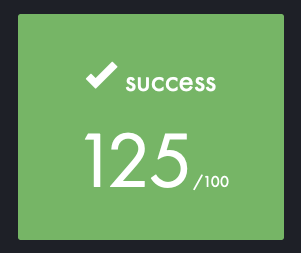

<br>

---

<br>

<details>
<summary>FRENCH VERSION</summary>

<br>

## 📚 Sommaire

- [🎯 Objectif du projet](#🎯-objectif-du-projet)
- [🛠️ Stack technique](#🛠️-stack-technique)
- [📦 Arborescence indicative](#📦-arborescence-indicative)
- [💡 Concepts abordés](#💡-concepts-abordés)
- [⚙️ Configuration requise](#⚙️-configuration-requise)
- [🔐 Sécurité & durcissement](#🔐-sécurité--durcissement)
- [📜 Script de monitoring](#📜-script-de-monitoring)
- [🧪 Tests & vérifications](#🧪-tests--vérifications)
- [🚀 Bonus possibles](#🚀-bonus-possibles)
- [📄 Fichier de rendu attendu](#📄-fichier-de-rendu-attendu)
- [🧠 Liens utiles](#🧠-liens-utiles)
- [📌 Licence](#📌-licence)

---

## 🎯 Objectif du projet

Mettre en place une machine virtuelle Linux durcie, sans interface graphique, respectant les bonnes pratiques d’administration système :

- Création d’un serveur sécurisé (Debian ou Rocky Linux).
- Configuration fine de la politique de sécurité (mots de passe, sudo, firewall).
- Application de normes système (partitionnement LVM chiffré, SELinux/AppArmor).
- Automatisation du monitoring avec un script bash.

---

## 🛠️ Stack technique

| Composant         | Détail                                                      |
|-------------------|-------------------------------------------------------------|
| **Hyperviseur**   | VirtualBox (ou UTM pour macOS/Apple Silicon)                |
| **OS supporté**   | Debian (stable) ou Rocky Linux (stable)                     |
| **Firewall**      | `ufw` (Debian) ou `firewalld` (Rocky)                       |
| **Surveillance**  | `cron`, `wall`, script bash `monitoring.sh`                 |
| **Chiffrement**   | LVM avec partitionnement personnalisé                       |
| **Authentification** | `sudo`, PAM, SSH (port 4242, accès root désactivé)      |

---

## 📦 Arborescence indicative

> Basé sur le guide [42-born2beroot_guide](https://github.com/chlimous/42-born2beroot_guide)

```
.
├── signature.txt           # Signature SHA1 du disque virtuel (obligatoire)
├── monitoring.sh           # Script Bash de monitoring système
├── README.md               # Présent fichier de documentation
├── conf/                   # Dossiers de configuration (firewall, sudoers, pam.d, etc.)
│   ├── sudoers
│   └── ufw-rules
└── doc/                    # Screenshots, logs, résultats de tests
```

---

## 💡 Concepts abordés

- 🔐 **Sécurité système** : Politique de mots de passe avancée, restriction sudo, audit des commandes.
- 🧩 **Partitionnement LVM** : Création de volumes chiffrés, séparation logique.
- 🚫 **Désactivation accès root via SSH**
- 🧱 **Firewall minimaliste** : uniquement le port 4242 ouvert.
- 🖥️ **Monitoring automatique** via cron toutes les 10 min.
- 📜 **Conformité au standard Debian/Rocky** sans environnement graphique.

---

## ⚙️ Configuration requise

- Hostname : `<login>42`
- Un utilisateur non-root avec les droits `sudo` et les groupes `user42`, `sudo`.
- Services activés au boot :
  - SSH (port 4242, sans accès root)
  - Firewall actif
  - Cron + script `monitoring.sh`

---

## 🔐 Sécurité & durcissement

### 🔑 Politique de mot de passe (PAM)
- Expiration : 30 jours
- Modification minimale : 2 jours
- Préavis d’expiration : 7 jours
- Complexité : min. 10 caractères, 1 majuscule, 1 minuscule, 1 chiffre
- Interdiction d’inclure le nom d’utilisateur

### 🔒 Règles sudo
- Limite à 3 tentatives erronées
- Message d’erreur personnalisé
- Historique complet dans `/var/log/sudo/`
- TTY obligatoire
- PATH limité : `/usr/local/sbin:/usr/local/bin:/usr/sbin:/usr/bin:/sbin:/bin:/snap/bin`

---

## 📜 Script de monitoring (`monitoring.sh`)

Diffusé via `wall` toutes les 10 minutes :

### Informations collectées :
- Architecture système et version du kernel
- Nombre de CPU physiques et virtuels
- RAM/disque : usage total + pourcentage
- Charge CPU
- Dernier redémarrage
- LVM actif ou non
- Connexions TCP actives
- Utilisateurs connectés
- Adresse IP & MAC
- Nombre de commandes `sudo` exécutées

> Interruption via `cron` sans toucher au script.

---

## 🧪 Tests & vérifications

| Élément à vérifier        | Commande indicative                                      |
|---------------------------|-----------------------------------------------------------|
| Signature disque          | `sha1sum disk.vdi`                                        |
| Services actifs au boot   | `systemctl list-unit-files --type=service`                |
| Firewall                  | `sudo ufw status` ou `sudo firewall-cmd --list-all`       |
| PAM/Sudo policy           | `chage -l <user>`, `/etc/login.defs`, `/etc/sudoers`     |
| SSH sécurisé              | `sshd_config`, test sur port 4242 sans root               |

---

## 🚀 Bonus possibles

- Partitions avancées : `/`, `/boot`, `/home`, `/var/log`, etc.
- Serveur **WordPress** via **lighttpd**, **MariaDB**, **PHP**
- Service personnel utile (hors NGINX/Apache) justifié à l’oral
- Configuration UFW adaptée selon les services

> ⚠️ Les bonus ne sont pris en compte **que si la partie obligatoire est parfaite**.

---

## 📄 Fichier de rendu attendu

```txt
signature.txt
```

Contenant la **signature SHA1** de votre disque virtuel (`.vdi` ou `.qcow2`)  

Exemples :
```bash
sha1sum rocky_serv.vdi
shasum ~/Library/.../disk-0.qcow2
```

---

## 🧠 Liens utiles

- ~~[42 Born2beRoot by Pasquale Rossi](https://github.com/pasqualerossi/Born2BeRoot-Guide)~~ RIP
- [42 Born2beRoot Guide by chlimous](https://github.com/chlimous/42-born2beroot_guide)
- [42 disks partitioning video](https://www.youtube.com/watch?v=2w-2MX5QrQw)
- 🔗 [Guide Born2beRoot complet (GitHub)](https://github.com/chlimous/42-born2beroot_guide)
- 📖 [Documentation officielle Debian](https://wiki.debian.org/fr/)
- 🧩 [Documentation SELinux / AppArmor](https://wiki.debian.org/AppArmor)
- 🔐 [PAM Password Policy](https://linux.die.net/man/5/pam_pwquality)

---

## Score



---

## 📌 Licence

Projet éducatif réalisé dans le cadre du cursus 42 Lausanne.  
Distribué sous [42 Unlicense](./LICENSE)

---

</details>

<br>

---

<br>

<details>
<summary>ENGLISH VERSION</summary>

<br>

## 📚 Table of Contents

- [🎯 Project Objective](#🎯-project-objective)
- [🛠️ Technical Stack](#🛠️-technical-stack)
- [📦 Indicative Structure](#📦-indicative-structure)
- [💡 Key Concepts](#💡-key-concepts)
- [⚙️ Requirements](#⚙️-requirements)
- [🔐 Security & Hardening](#🔐-security--hardening)
- [📜 Monitoring Script](#📜-monitoring-script)
- [🧪 Tests & Verifications](#🧪-tests--verifications)
- [🚀 Possible Bonuses](#🚀-possible-bonuses)
- [📄 Expected Submission File](#📄-expected-submission-file)
- [🧠 Useful Links](#🧠-useful-links)
- [📌 License](#📌-license)

---

## 🎯 Project Objective

Set up a hardened Linux virtual machine, without a graphical interface, following system administration best practices:

- Create a secure server (Debian or Rocky Linux).
- Fine-tune security policies (passwords, sudo, firewall).
- Apply system standards (encrypted LVM partitioning, SELinux/AppArmor).
- Automate monitoring with a bash script.

---

## 🛠️ Technical Stack

| Component         | Details                                                     |
|-------------------|-------------------------------------------------------------|
| **Hypervisor**    | VirtualBox (or UTM for macOS/Apple Silicon)                 |
| **Supported OS**  | Debian (stable) or Rocky Linux (stable)                     |
| **Firewall**      | `ufw` (Debian) or `firewalld` (Rocky)                       |
| **Monitoring**    | `cron`, `wall`, bash script `monitoring.sh`                 |
| **Encryption**    | LVM with custom partitioning                                |
| **Authentication**| `sudo`, PAM, SSH (port 4242, root access disabled)          |

---

## 📦 Indicative Structure

Based on the guide [42-born2beroot_guide](https://github.com/chlimous/42-born2beroot_guide)

```
.
├── signature.txt           # SHA1 signature of the virtual disk (mandatory)
├── monitoring.sh           # Bash script for system monitoring
├── README.md               # This documentation file
├── conf/                   # Configuration folders (firewall, sudoers, pam.d, etc.)
│   ├── sudoers
│   └── ufw-rules
└── doc/                    # Screenshots, logs, test results
```

---

## 💡 Key Concepts

- 🔐 **System Security**: Advanced password policy, sudo restrictions, command auditing.
- 🧩 **LVM Partitioning**: Creation of encrypted volumes, logical separation.
- 🚫 **Disable root access via SSH**
- 🧱 **Minimalist Firewall**: Only port 4242 open.
- 🖥️ **Automatic Monitoring** via cron every 10 minutes.
- 📜 **Compliance with Debian/Rocky standards** without a graphical environment.

---

## ⚙️ Requirements

- Hostname: `<login>42`
- A non-root user with `sudo` rights and membership in `user42`, `sudo` groups.
- Services enabled at boot:
	- SSH (port 4242, no root access)
	- Active firewall
	- Cron + `monitoring.sh` script

---

## 🔐 Security & Hardening

### 🔑 Password Policy (PAM)
- Expiration: 30 days
- Minimum modification interval: 2 days
- Expiration warning: 7 days
- Complexity: min. 10 characters, 1 uppercase, 1 lowercase, 1 digit
- Prohibit inclusion of the username

### 🔒 Sudo Rules
- Limit to 3 incorrect attempts
- Custom error message
- Full history in `/var/log/sudo/`
- TTY required
- PATH restricted to: `/usr/local/sbin:/usr/local/bin:/usr/sbin:/usr/bin:/sbin:/bin:/snap/bin`

---

## 📜 Monitoring Script (`monitoring.sh`)

Broadcast via `wall` every 10 minutes:

### Collected Information:
- System architecture and kernel version
- Number of physical and virtual CPUs
- RAM/disk: total usage + percentage
- CPU load
- Last reboot
- LVM active or not
- Active TCP connections
- Connected users
- IP & MAC address
- Number of `sudo` commands executed

> Interrupt via `cron` without modifying the script.

---

## 🧪 Tests & Verifications

| Element to Verify         | Indicative Command                                      |
|---------------------------|--------------------------------------------------------|
| Disk signature            | `sha1sum disk.vdi`                                     |
| Services active at boot   | `systemctl list-unit-files --type=service`             |
| Firewall                  | `sudo ufw status` or `sudo firewall-cmd --list-all`    |
| PAM/Sudo policy           | `chage -l <user>`, `/etc/login.defs`, `/etc/sudoers`   |
| Secure SSH                | `sshd_config`, test on port 4242 without root          |

---

## 🚀 Possible Bonuses

- Advanced partitions: `/`, `/boot`, `/home`, `/var/log`, etc.
- **WordPress server** via **lighttpd**, **MariaDB**, **PHP**
- A personal service (excluding NGINX/Apache) justified during the oral exam
- UFW configuration adapted to the services

> ⚠️ Bonuses are considered **only if the mandatory part is perfect**.

---

## 📄 Expected Submission File

```txt
signature.txt
```

Containing the **SHA1 signature** of your virtual disk (`.vdi` or `.qcow2`)  

Examples:
```bash
sha1sum rocky_serv.vdi
shasum ~/Library/.../disk-0.qcow2
```

---

## 🧠 Useful Links

- ~~[42 Born2beRoot by Pasquale Rossi](https://github.com/pasqualerossi/Born2BeRoot-Guide)~~ RIP
- [42 Born2beRoot Guide by chlimous](https://github.com/chlimous/42-born2beroot_guide)
- [42 disks partitioning video](https://www.youtube.com/watch?v=2w-2MX5QrQw)
- 🔗 [Complete Born2beRoot Guide (GitHub)](https://github.com/chlimous/42-born2beroot_guide)
- 📖 [Official Debian Documentation](https://wiki.debian.org/)
- 🧩 [SELinux / AppArmor Documentation](https://wiki.debian.org/AppArmor)
- 🔐 [PAM Password Policy](https://linux.die.net/man/5/pam_pwquality)

---

## Score


---

## 📌 License

Educational project created as part of the 42 Lausanne curriculum.  
Distributed under [42 Unlicense](./LICENSE)

---

</details>
